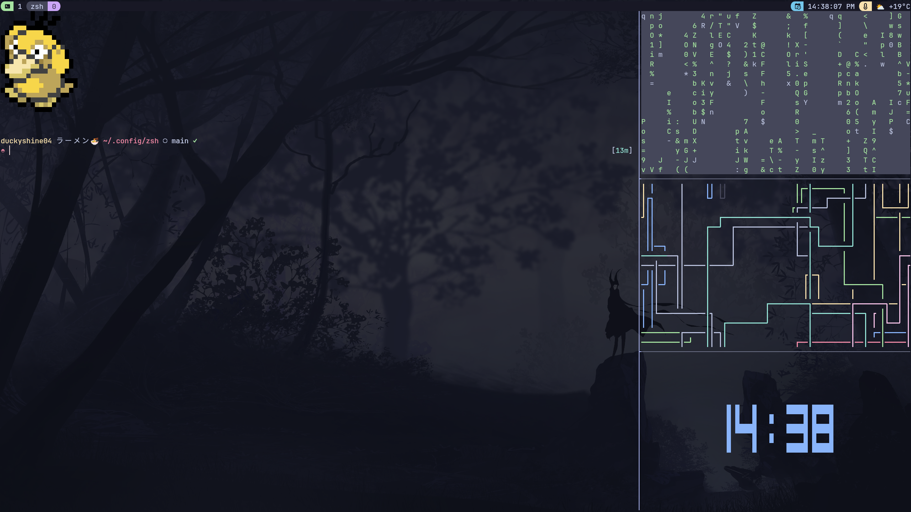
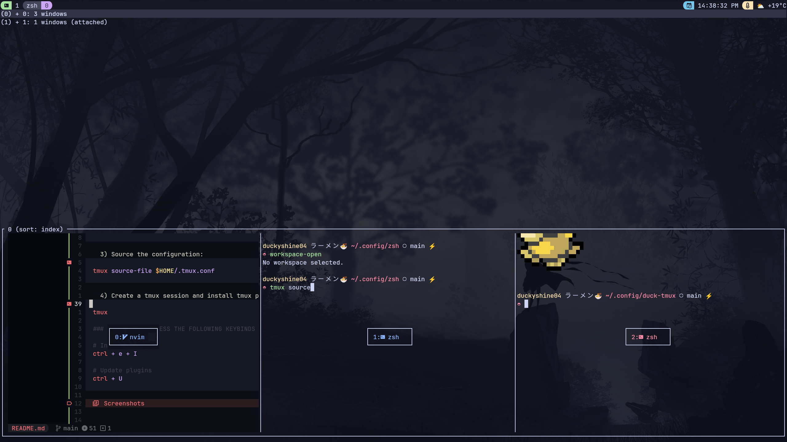

# duck-tmux
duck-time is my personal tmux configuration.

## Table of Contents
- [Getting Started](#getting-started)
    - [Requirements](#requirements)
    - [Installation](#installation)
- [Screenshots](#screenshots)

## Getting Started
This section will guide you through installing **duck-tmux**.

### Requirements
* [tmux](https://github.com/tmux/tmux) are you sure you have tmux installed already? :confused:
* [yq](https://github.com/mikefarah/yq) for statusline.

### Installation
After you have met the requirements, proceed to follow the installation steps.

1) Clone the repository using the following command:
```sh
# Make .config directory if your system doesn't already have one
mkdir -p $HOME/.config && cd $HOME/.config

# Clone my repo
git clone https://github.com/DuckyShine004/duck-tmux.git
```

2) After cloning the repository, create a symlink for the tmux configuration file:
```sh
ln -s $HOME/.config/duck-tmux/.tmux.conf $HOME/.tmux.conf
```

3) Source the configuration:
```sh
tmux source-file $HOME/.tmux.conf
```

4) Create a tmux session and install tmux plugins:
```sh
tmux

### WITHIN TMUX PRESS THE FOLLOWING KEYBINDS (key sensitive keybinds)

# Install plugins
ctrl + e + I

# Update plugins
ctrl + U
```

## Screenshots




